# Hypertree

[Concepts](https://github.com/stevanapter/hypertree#concepts)

[Structure](https://github.com/stevanapter/hypertree#structure)

[Click Events](https://github.com/stevanapter/hypertree#click-events)

[Button Events](https://github.com/stevanapter/hypertree#button-events)

[Scrolling and Update](https://github.com/stevanapter/hypertree#scrolling-and-update)

[Parameters](https://github.com/stevanapter/hypertree#parameters)

[Calculation](https://github.com/stevanapter/hypertree#calculation)

[Use](https://github.com/stevanapter/hypertree#use)

[Scripts](https://github.com/stevanapter/hypertree#scripts)

[Style](https://github.com/stevanapter/hypertree#style)

[Enhancements](https://github.com/stevanapter/hypertree#enhancements)

Concepts
--------

Hypertree is a q server which adds tree- and pivot-table calculation to [Hypergrid](http://openfin.github.io/fin-hypergrid/components/fin-hypergrid/demo.html?tab=4).

Hypertree is based on an improved version of the algorithm described [here](http://archive.vector.org.uk/art10500340).

What follows is a brief overview.

Suppose our tree has the following structure:

	0
	 1
	  2
	  3
	 4
	  5
	   6
	   7
	   8

Data-elements are attached to the leaves of the tree:

	0
	 1
	  2	- 20
	  3 - 30
	 4
	  5
	   6 - 60
	   7 - 70
	   8 - 80

Aggregations at the nodes are calculated iteratively, bottom-up:

	0 = 2 + 3 + 6 + 7 + 8
	1 = 2 + 3
	4 = 5
	5 = 6 + 7 + 8

The iterative method requires that we have in hand the ultimate constituents -- the leaves -- of each node:

	0 : 2 3 6 7 8
	1 : 2 3
	4 : 5
	5 : 6 7 8

We compute the leaves by first constructing the "parent vector" of our tree:

	p:0 0 1 1 0 4 5 5 5

p[i] is the parent of element i:

	q)p 5
    4

Ascend from any leaf to the root node:

	q)p 8
	5
	q)p 5
	4
	q)p 4
	0

The root is self-parenting:

	q)p 0
	0
	q)p p p p p p 0
	0

Converge from any leaf to the root:

	q)p over 8
	0
	q)p scan 8
	8 5 4 0

Generate all paths from ultimate constituents:

	q)i:(p scan)each til count p
	q)i
	,0
	1 0
	2 1 0
	3 1 0
	4 0
	5 4 0
	6 5 4 0
	7 5 4 0
	8 5 4 0

The ultimate constituents:

	q)l:til[count p]except p
	q)l
	2 3 6 7 8

Populate the leaves with data-elements:

	q)d:@[count[p]#0;l;:;l*10]
	q)d
	0 0 20 30 0 0 60 70 80

and use the path-list to sum up from the leaves:

	q)s:@[count[p]#0;i;+;d]
	q)s
	260 50 20 30 210 210 60 70 80

Hypertree provides support for user-defined aggregation functions, or "rollups".  A rollup is a function which maps lists to atoms.

A companion utility, [Hypercalc](https://github.com/stevanapter/hypercalc), provides a mechanism whereby the application can define calculated columns, or "willbes".  A willbe is a function which maps lists of count n to lists of count n.

Together, Hypertree and Hypercalc can be used to define automatically recalculating hierarchical treetable and pivot-tables.

Hypertree pivot-tables are two-dimensional slices of a three-dimensional cube.  

For this, we rely on a version of the function presented by Nick Psaris in his book Q-TIPS.  Our version of Nick's function:

	pcalc:{[t;z;y;x]?[t;();y!y,:();({x#(`$string y)!z}`$string asc distinct t x;x;z)]}  

The basic idea of a three-dimensional hierarchically nested pivot table -- a "pivot-cube" -- was first developed in the k2 algorithm [here](http://www.nsl.com/papers/drilldown.htm).

Conceptually, a pivot table is built from the unique values of two axes X and Y, where the cell z at the intersection of X and Y is an aggregation of a further column Z, a member of F.

In Hypertree pivot mode, we can visualize the aggregatable columns F to lie on the z axis, with the display showing one slice at a time.  The Back and Forth buttons allow us to move back and forth on this axis, showing aggregations of the different columns in F.

In pivot mode, clicking on the down-triangle icon of the header of column A at value V will cause Hypertree to restrict the underlying table T to records where A = V, and then explode the X axis of the pivot to column B in G = .. A B .. .

Similarly, clicking on value V of column A in the Hierarchy column while in pivot mode will cause Hypertree to restrict the underlying table T to records where A = V, and then explode the Y axis of the pivot to column B in G = .. A B .. .

Double-clicking on a cell XY while in pivot mode is equivalent to performing a column pivot followed by a row pivot.

Finally, clicking on the up-triangle of the header of the Hierarchy column causes the last pivot action to be undone.

Hypertree thus provides drill-down interaction on both X, Y, and Z axes of a three-dimensional hierarchical pivot table.

In a future version of Hypertree we will support condensing planes of the pivot cube into "super-cells" containing multiple z values.

Structure
---------

Given the underlying table T + Hypertree parameters .ht.cons returns Z, the Hypertree table.

Column names beginning with a lower-case letter followed by one or more _'s are reserved for Hypertree use.

The Hypertree table structure is encoded in the six columns n_, e_, l_, o_, p_, and g_:

	q)?[Z;();0b;c!c:`n_`e_`l_`o_`p_`g_]
	n_                          e_ l_ o_ p_ g_         
	---------------------------------------------------
	()                          0  0  1  0             
	,`abbott                    0  1  0  0  abbott     
	,`chico                     0  1  1  0  chico      
	`chico`energy               0  2  0  2  energy     
	`chico`financials           0  2  1  2  financials 
	`chico`financials`chart     0  3  0  4  chart      
	`chico`financials`house     0  3  0  4  house      
	`chico`financials`indexarb  0  3  0  4  indexarb   

	n_:  path to record
	e_:  leaf?
	l_:  level (0 = root, i>0 = child of i-1)
	o_:  open?
	p_:  parent vector
	g_:  last each n_ (hierarchy column)

Click Events
------------

	row:		in treetable mode, click on an element in the Hierarchy column to expand
				from or contract to that row.

				in pivot mode, click on an element in the Hierarchy column to select that
				row-value and explode on the next group.

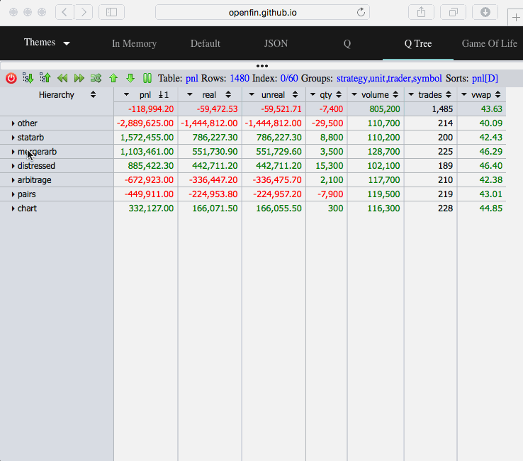

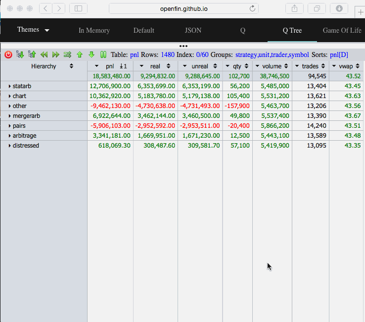

	col:		in treetable mode, click on a column to pivot the table on the column-value.

				in pivot mode, click on a column to select that column-value and explode on 
				the next group.

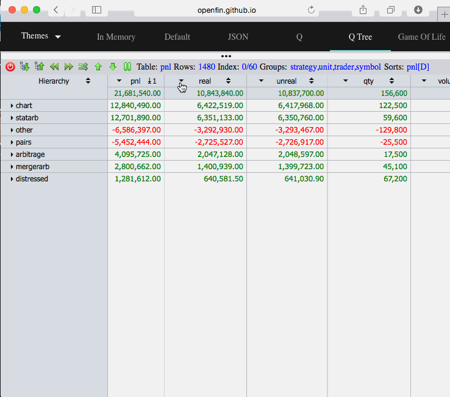

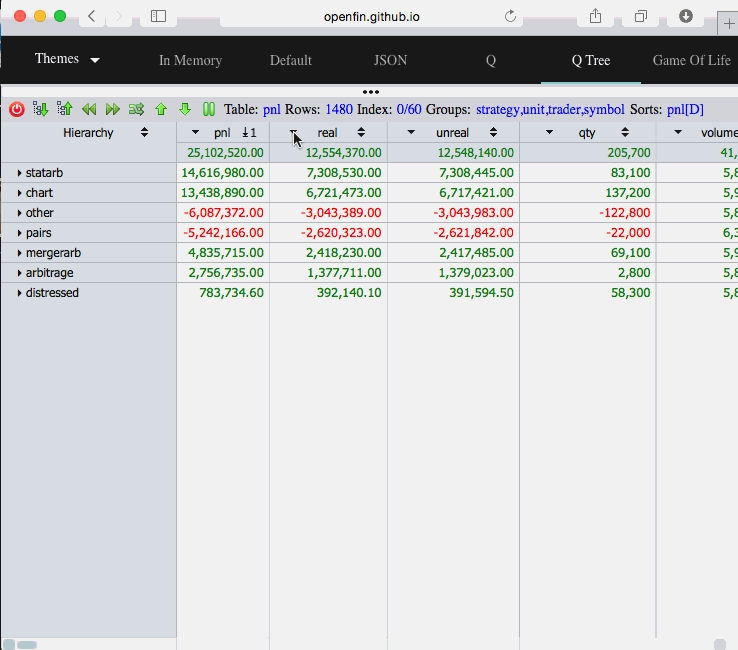

	cell:		double-click on a cell to restrict the table to the row-value and pivot the 
				resulting table on the column-value.

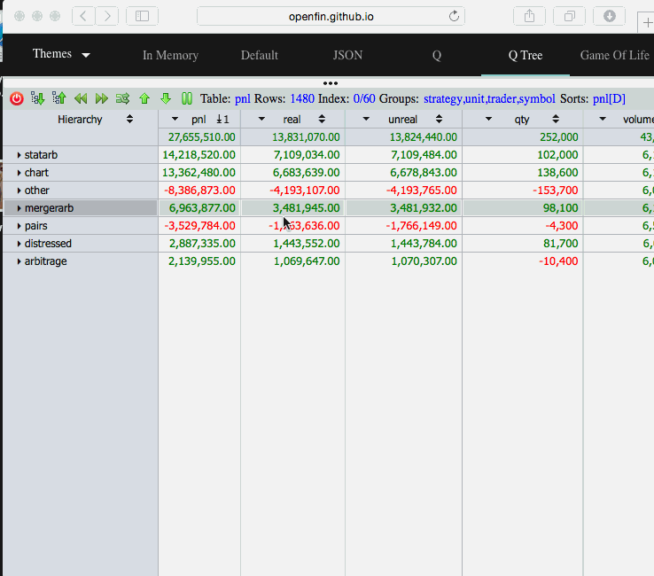

	sorts:		multi-sort the table ascending, descending, ascending-absolute-value, 
				descending-absolute-value.

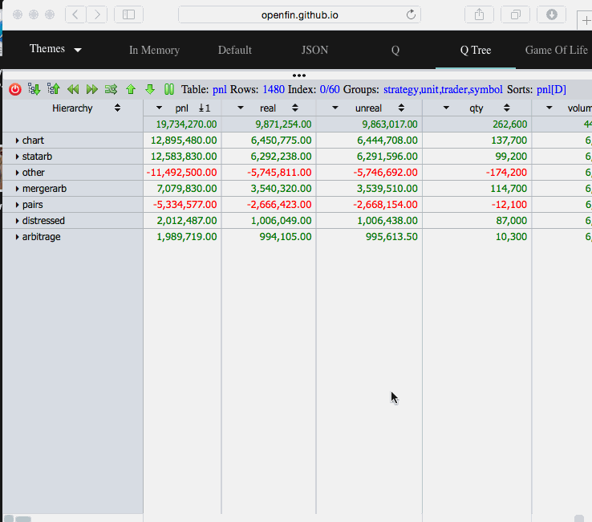

	groups:		press the alt/option key to summon a window which allows drag-and-drop 
				regrouping of the table, and to select which columns of the table are visible.

				columns may also be re-arranged directly with drag-and-drop.

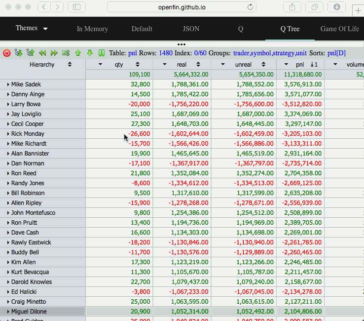

Button Events
-------------

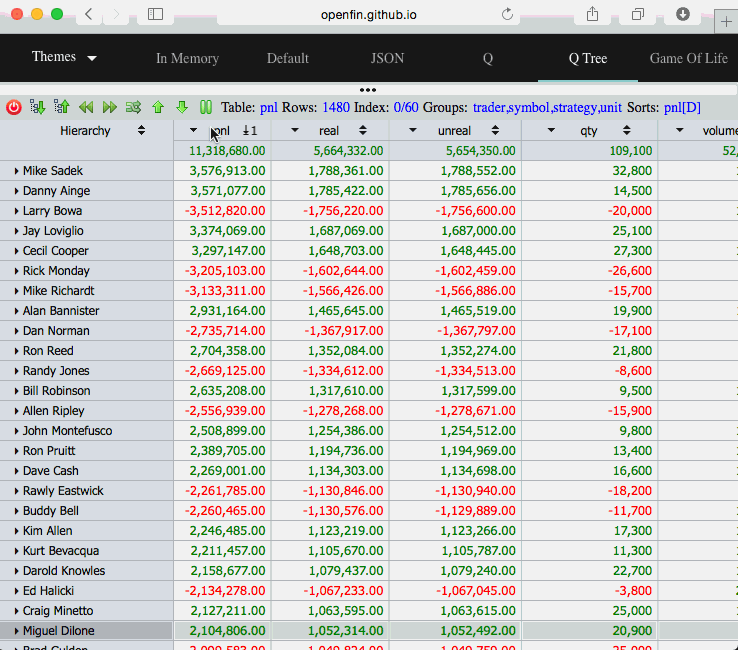

	Reset:		clear sorts, expansions, pivots, &c.

	Expand:		expand the tree to the level of the last group.

	Collapse:	collapse the tree to the level of the first group.

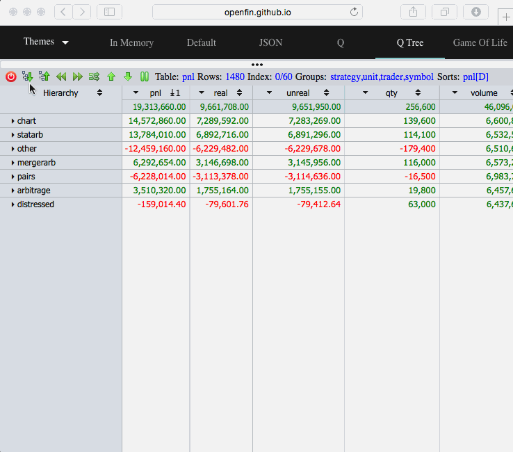

	Back:		Pick the previous column on the z-axis to pivot on.

	Forth:		Pick the next column on the z-axis to pivot on.

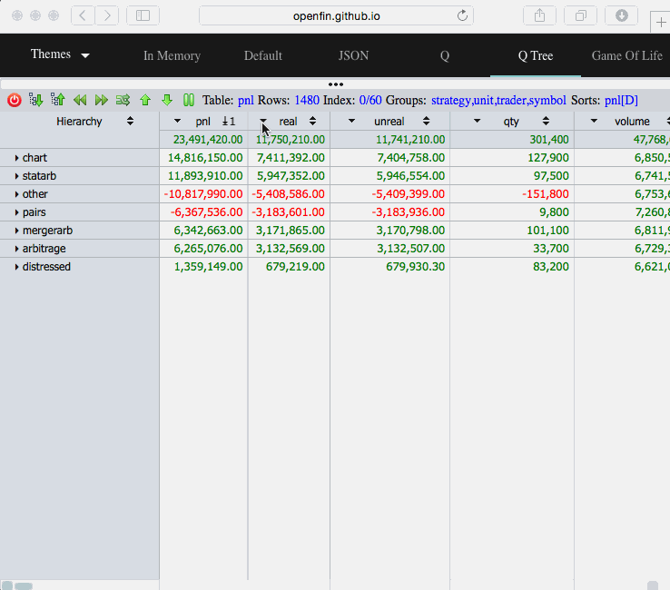

	Swap:		in treetable mode, swap G 0 and G 1:  G = x y .. z -> y x .. z

				in pivot mode, swap X and Y:  X Y -> Y X

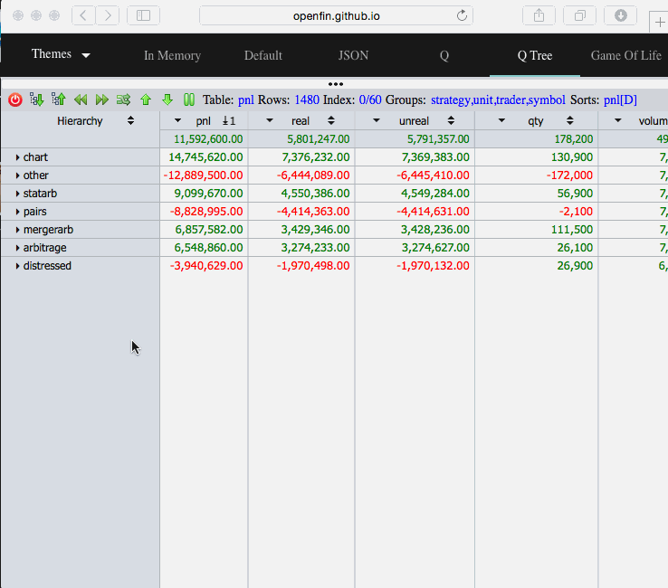
			
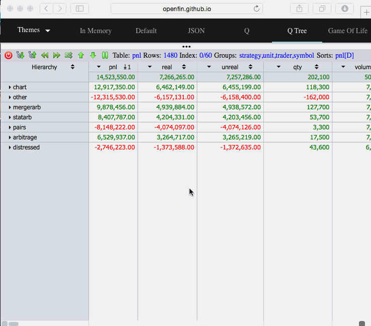
			
	Up:			rotate group-vector:  G = x y .. z -> z x y ..

	Down:		rotate group-vector:  G = x y .. z -> y .. z x

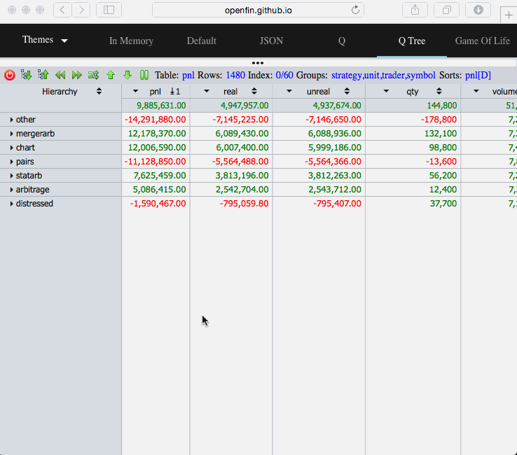

	Pause:		turn updates off.

	Play:		turn updates on.

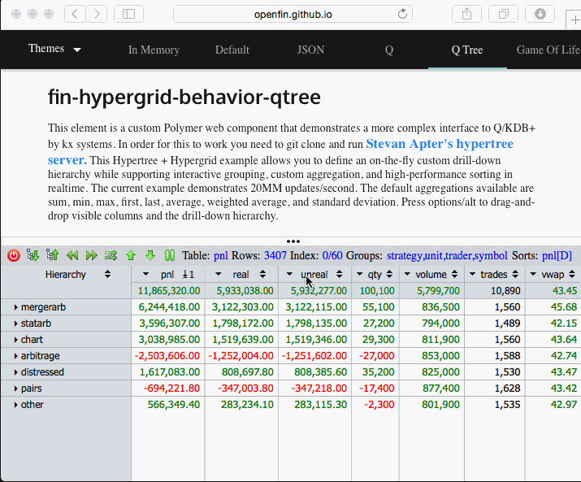

Scrolling and Update
--------------------

On scrolling, Hypergrid requests a subtable	of Z:

	get:		send a subtable of the current state of Z to Hypergrid.

Hypertree also supports update.  For example, if the underlying table is t:

	\t 1000
	.z.ts:{update ... from `t ...;.js.upd`}

This causes Hypertree to recalculate and redisplay.

Note that Hypertree will recalculate the hierarchy based on both aggregating and grouping
columns.

[Hypercalc](https://github.com/stevanapter/hypercalc) can also be used to define automatically 
recalculating underlying views.

Parameters
----------

Hypertree behavior is controlled by a set of programmer-defined global variables.

Dependencies (*var::def) are internal functions and should not be redefined.  Other variables may be initialized on startup as part of d.q.

A: Rollups

	Rollup expressions are q parse-trees:

		A:()!()
		A[`f]:(avg;`f)
	
	Hypertree will use sensible defaults (e.g. sum for numeric.)

	Multiple rollups can be defined for a single column:

		A[`f`g`h]:((sum;`a);(avg;`a);(max;`a))

	Rollup functions map lists to atoms.  If the type of column c is t, then the
	type of the rollup of c must be -t.

	Columns defined in A which do not appear in T are "virtual":  their leaves are
	displayed as nulls.  E.g., in the following example g is virtual:

		t:([]f:10 20 30)
		T:`t
		A[`g]:(count;`f)

	'parse' can used to define complex rollup expressions:

		A[`k]:parse"sum[l]+sum m"

B: Not used

*C: Visible columns

	C::.ht.visible[Q;G]I

D: Not used

E: Not used

F: Visible columns in order

	F:0#`

G: Grouping columns in order

	G:0#`

	Any subset of exec c from meta T where t in"bhijspmdznuvt".

	Keys of the underlying table are not groupable.

	Hypertree understands grouping by symbolic and "discrete" values (including dates and 
	times.)

	When G is empty, the underlying table together with its grand total row is displayed:

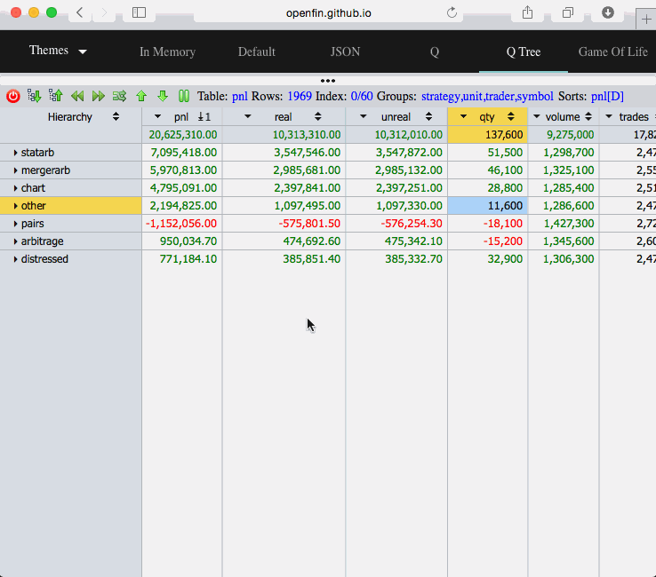

*H: Groupable columns

	H::.ht.groupable T 

*I: Invisible columns

	I::.ht.invisible[W;T;A;Q;F]G

J: Not used.

K: Sort vector

	Hypertree sort-state:  get[Z]K.

	K:(::)

L: Expand to leaves?

	L:1b

	By default, Hypertree expands to display the leaves of the treetable.  If this behavior
	is not desired (for example, because there are too many ultimate records, or because the
	data at the leaves is not interesting), set L to 0b.

M: Not used

*N: Row count

	N::count get T

O: Object properties

	O.:(::)

	Display properties can be coordinated between Hypertree and Hypergrid with the multi-level 
	dictionary O.  For example:

	O.columns.price:`USD

	O is designed as a completely general way to put Hypergrid display characteristics under
	the control of the Hypertree application program.

	Consult the Hypergrid documentation for a full description of this feature.

P: Instruction state = (current;prior)

	P:.ht.paths

	The state of the Hypertree is represented as a pair of keytables.  P 0 represents the 
	current state, and P 1 represents the previous state.  n (the key) is a list of paths to
	nodes which have at any time been opened, and v is a boolean vector saying whether the 
	corresponding node is now open or closed.

	For example:

	q)P 0
	n                                             | v
	----------------------------------------------| -
	(`symbol$())!()                               | 1
	(,`trader)!,`costello                         | 0
	`trader`sector!`costello`energy               | 1
	`trader`sector`strategy!`costello`energy`house| 1

	q)P 1
	n                                             | v
	----------------------------------------------| -
	(`symbol$())!()                               | 1
	(,`trader)!,`costello                         | 1
	`trader`sector!`costello`energy               | 1
	`trader`sector`strategy!`costello`energy`house| 1

*Q: q-types

	Q::.ht.qtype get Z

	Q is a dictionary of q-types by column.  For example, Q.N = "j".

R: Rows -> Hypergrid (scrolling)

	R:`start`end!0 100

S: Sorts = cols!(..{`a`d`A`D}..)

	S:()!()

	a = ascending
	d = descending
	A = ascending absolute
	D = descending absolute

	For example:  S:`foo`bar!`D`a for ascending bar within descending-absolute foo.

T: Table

	The table underlying Hypertree, either keyed or unkeyed.

	T:`t

U: Update?

	U:0N

	If U is null, do not show Pause or Play buttons.

	If U is boolean, then Play (1b) or Pause (0b) updates.

V: Not Used.

W: Pivot state = ((z-col;Q);selects;groups;sorts)

	W:.ht.W = (();();();())

	W[0] = (pivot column;value of Q for T)
	W[1] = (..;(=;column;value);..)					list of constraint expressions
	W[2] = (..;previous value of G;..)				list of group vectors
	W[3] = (..;previous value of S;..)				list of sort dictionaries

	Pivot and Y Axis drill-down operations are mutually exclusive.

	W keeps track of the sequence of pivot operations, and allows the user to unwind from the 
	current to the previous pivot-state.  

	NEW: Sorts are now preserved.

	Note that the application (d.q) can define an initial state for W.

*X: X axis

	X::$[count W 1;first 1_G except W[1;;1];G 1]

*Y: Y axis

	Y::G 0

Z: Hypertree

	Z:`z

	Z is symmetrical with T:  a pointer to the Hypertree result-table.

Calculation
-----------

Hypertree calculates rollups on every Y-axis drilldown event, and on every X- or XY-pivot event, and on every update to the underlying data.

Use
---

Single process:

	Start hypertree process (default port 12345, \t = 0):

		cd hypertree
		q h.q

	The one-process version single-threads q updates and Hypergrid interaction.

Two-process:

	Start hypertree client (default port 12345):

		cd hypertree
		q c.q

	Start hypertree server (default port 12346):

		cd hypertree
		q s.q

	Client and server processes may be started in either order.

	The two-process version decouples q update and Hypergrid interaction.

	By default, both client and server start on the same host.

After starting either the single process or the two-process version of Hypergrid, start [Hypergrid](http://openfin.github.io/fin-hypergrid/components/fin-hypergrid/demo.html?tab=4).

Scripts
-------

	q.q 			enhance json to filter infinities
	d.q             data and parameter definition
	e.q             hypergrid events
	t.q             hypertree calculation
	i.q 			initial state (used by reset)
	j.q             javascript interaction utilities
	x.q             hypertree parameters
	a.q             auxilliary functions
	l.q             console logging functions

	h.q             standalone hypertree process

	c.q             hypertree client process
	s.q             hypertree server process

Style
-----

The coding style of Hypertree assumes that both client and server processes are detached from the application which uses them.  That is, h.q, c.q, and s.q are directly loaded using q h.q, q c.q, or q s.q, and loaded into the application with \l.  

The d.q script is the API for hypertree, through which the application environment is presented to Hypertree by means of some combination of \l, file-reads, and interprocess communication.

For this reason, the Hypertree parameters are defined in the root context as global variables A .. Z, and a subset of A_ .. Z_.
	

Enhancements
------------

Static rollups (NOT YET IMPLEMENTED):

	Create a dictionary whose keys are a subset of the permutations of G.

	q).af.set`:t
	q).af.get`:t
	sector   strategy trader  | :../t/sector.strategy.trader
	sector   trader   strategy| :../t/sector.trader.strategy
	strategy sector   trader  | :../t/strategy.sector.trader
	strategy trader   sector  | :../t/strategy.trader.sector
	trader   sector   strategy| :../t/trader.sector.strategy
	trader   strategy sector  | :../t/trader.strategy.sector

	Then in d.q:

	T:(`t;.af.get`:t)   (OR:  u:.af.get`:t;T:`t`u)

	u is a dictionary whose keys are drawn from the permutations g of G and whose values 
	are symbols of, or the actual complete rollup trees for t and each g.
