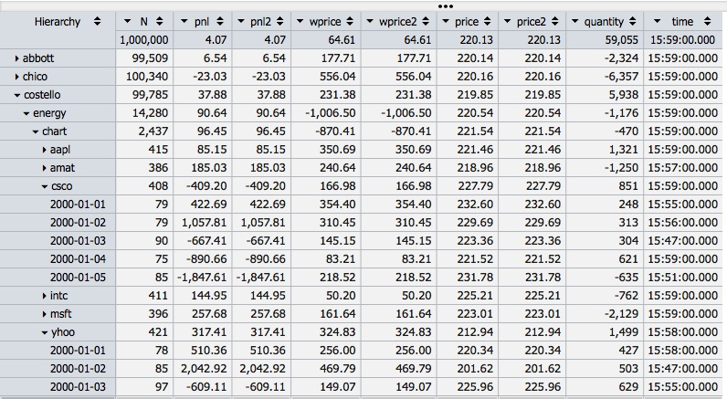
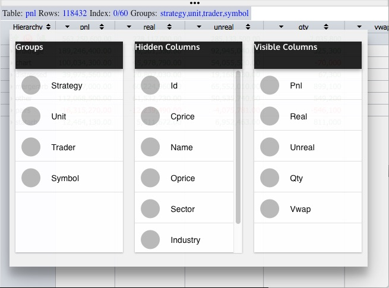
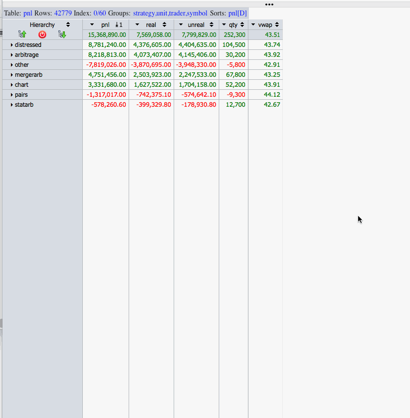
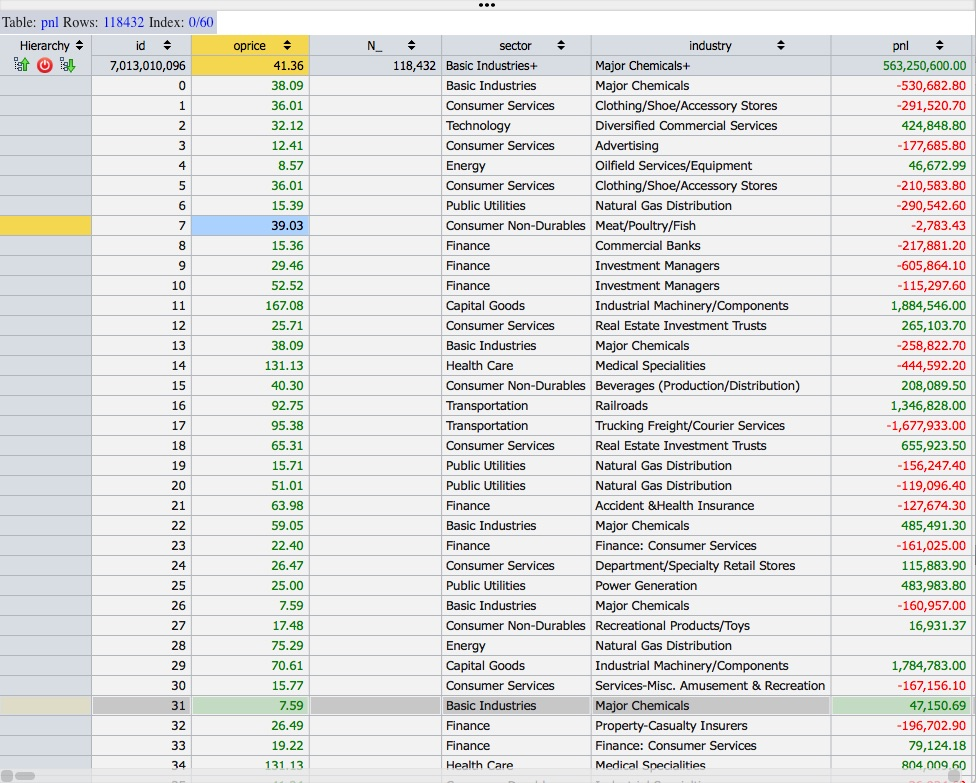
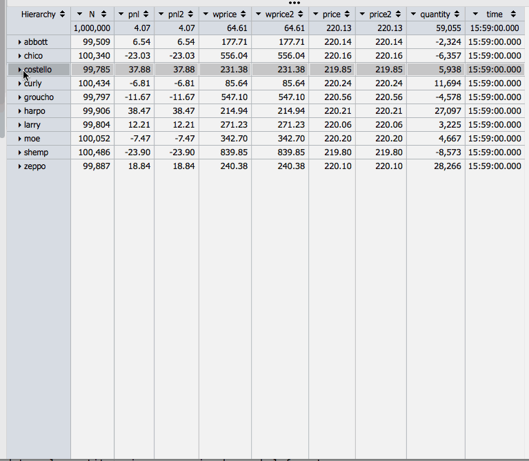

# Hypertree2

[Concepts](https://github.com/stevanapter/hypertree2#concepts)

[Structure](https://github.com/stevanapter/hypertree2#structure)

[Events](https://github.com/stevanapter/hypertree2#events)

[Parameters](https://github.com/stevanapter/hypertree2#parameters)

[Calculation](https://github.com/stevanapter/hypertree2#calculation)

[Use](https://github.com/stevanapter/hypertree2#use)

[Scripts](https://github.com/stevanapter/hypertree2#scripts)

[Examples](https://github.com/stevanapter/hypertree2#examples)

Concepts
--------

Hypertree2 is a q server which adds tree- and pivot-table calculation to [Hypergrid](http://openfin.github.io/fin-hypergrid/components/fin-hypergrid/demo.html?tab=4).

Hypertree2 is based on an improved version of the algorithm used in [Hypertree](https://github.com/stevanapter/hypertree), described [here](http://archive.vector.org.uk/art10500340).

What follows is a brief overview:

Suppose our tree has the following structure:

	0
	 1
	  2
	  3
	 4
	  5
	   6
	   7
	   8

Data-elements are attached to the leaves of the tree:

	0
	 1
	  2	- 20
	  3 - 30
	 4
	  5
	   6 - 60
	   7 - 70
	   8 - 80

To calculate sums for the nodes of the tree we calculate iteratively, bottom-up:

	0 = 2 + 3 + 6 + 7 + 8
	1 = 2 + 3
	4 = 5
	5 = 6 + 7 + 8

The iterative method requires that we have in hand the ultimate constituents -- the leaves -- of each node:

	0 : 2 3 6 7 8
	1 : 2 3
	4 : 5
	5 : 6 7 8

we compute the leaves of each node by first constructing the "parent vector" of our tree:

	p:0 0 1 1 0 4 5 5 5

p[i] is the parent of element i:

	q)p 5
    4

We can "climb the tree" from any leaf to the root node:

	q)p 8
	5
	q)p 5
	4
	q)p 4
	0

The root is self-parenting:

	q)p 0
	0
	q)p p p p p p 0
	0

So using "converge":

	q)p over 8
	0
	q)p scan 8
	8 5 4 0

To generate all paths from ultimate constituents:

	q)i:(p scan)each til count p
	q)i
	,0
	1 0
	2 1 0
	3 1 0
	4 0
	5 4 0
	6 5 4 0
	7 5 4 0
	8 5 4 0

The ultimate constituents:

	q)l:til[count p]except p
	q)l
	2 3 6 7 8

Now we can populate the leaves with data-elements:

	q)d:@[count[p]#0;l;:;l*10]
	q)d
	0 0 20 30 0 0 60 70 80

and use the path-list to sum up from the leaves:

	q)s:@[count[p]#0;i;+;d]
	q)s
	260 50 20 30 210 210 60 70 80

Hypertree also supports one- and two-dimensional pivot-table views.

For this, we rely on a simplified version of an algorithm devised by Nick Psaris in his book Q-TIPS.

Hypertree thus provides drill-down interaction on both X and Y axes.

Structure
---------

Given table T (the underlying table) + Hypertree Parameters (see below) .ht.cons produces Z, the Hypertree table.

Column names a_ through z_ are reserved for Hypertree use.

All other column names ending in _ are virtual rollups:  the leaves are nulled in the display.

The Hypertree table structure is encoded in the following six columns:

	q).ht.C
	`n_`e_`l_`o_`p_`g_

	q)?[Z;();0b;.ht.C!.ht.C]
	n_                          e_ l_ o_ p_ g_         
	---------------------------------------------------
	()                          0  0  1  0             
	,`abbott                    0  1  0  0  abbott     
	,`chico                     0  1  1  0  chico      
	`chico`energy               0  2  0  2  energy     
	`chico`financials           0  2  1  2  financials 
	`chico`financials`chart     0  3  0  4  chart      
	`chico`financials`house     0  3  0  4  house      
	`chico`financials`indexarb  0  3  0  4  indexarb   

	n_:  path to record
	e_:  leaf?
	o_:  open?
	p_:  parent vector
	g_:  last each n_ (hierarchy column)

z_ is used internally as a dummy column.

Events
------

Hypertree understands a limited number of user-initiated events:

	row:		click on an element in the Hierarchy column to expand from or contract to 
				that row.

	col:		click on a column to pivot the table.

	cell:		click on a cell to restrict the table to the row-value and pivot the resulting
				table on the column-value.

	sorts:		multi-sort the table ascending, descending, ascending-absolute-value, 
				descending-absolute-value.

	get:		send a subtable of the current state of the table to Hypergrid.

	groups:		press the alt/option key to summon a window which allows drag-and-drop 
				regrouping of the table, and to select which columns of the table are visible.

	NEW! reset:			clear sorts, expansions, pivots, &c.

	NEW! expand:		expand the tree to the level of the last group.

	NEW! collapse:		collapse the tree to the level of the first group.

Hypertree also supports update.  For example, if the underlying table is t:

	\t 1000
	.z.ts:{update ... from `t ...;.js.upd`}

This causes Hypertree to recalculate and redisplay:

Note that Hypertree will recalculate the hierarchy based on both aggregating and grouping
columns.

[Hypercalc](https://github.com/stevanapter/hypercalc) can also be used to define automatically 
recalculating underlying views.

Parameters
----------

Hypertree behavior is controlled by a set of programmer-defined global variables.

Variables defined as dependencies can be overriden by the programmer.

A: Rollups

	Rollup expressions are q parse-trees:

	A:()!()
	A[`f]:(avg;`f)
	
	Hypertree will use sensible defaults (e.g. sum for numeric.)

	Multiple rollups can be defined for a single column:

	A[`f`g`h]:((sum;`a);(avg;`a);(max;`a))

	Rollup functions map lists to atoms.  If the type of column c is t, then the
	type of the rollup of c must be -t.

F: Visible columns in order

	F:0#`

G: Grouping columns

	G:0#`

	Any subset of exec c from meta first T where t in"bhijspmdznuvt".

	Hypertree understands grouping by symbolic and "discrete" values (including dates and 
	times.)

	When G is empty, the underlying table together with its grand total row is displayed:

H: Groupable columns

	H::.ht.groupable T 

C: Visible columns

	C::.ht.visible[Q;G]I

I: Invisible columns

	I::.ht.invisible[W;T;A;Q;F]G

J: Infinity check?

	J:0b

	json chokes on q infinities.  At some not-insignificant computational cost, these can be 
	filtered out of the result before conversion to json by .j.j.  Better to not generate them
	at all!

L: Expand to leaves?

	L:1b

	By default, Hypertree expands to display the leaves of the treetable.  If this behavior
	is not desired (for example, because there are too many ultimate records, or because the
	data at the leaves is not interesting), set L to 1b.

O: Object properties

	O.:(::)

	Display properties can be coordinated between Hypertree and Hypergrid with the multi-level 
	dictionary O.  For example:

	O.columns.price:`USD

	O is designed as a completely general way to put Hypergrid display characteristics under
	the control of the Hypertree application program.

	Consult the Hypergrid documentation for a full description of this feature.

P: Instruction state = (current;prior)

	P:.ht.P

	The state of the Hypertree is represented as a pair of keytables.  P 0 represents the 
	current state, and P 1 represents the previous state.  n (the key) is a list of paths to
	nodes which have been opened, and v is a boolean vector saying whether the corresponding 
	node is open or closed.

	For example:

	q)P 0
	n                                             | v
	----------------------------------------------| -
	(`symbol$())!()                               | 1
	(,`trader)!,`costello                         | 0
	`trader`sector!`costello`energy               | 1
	`trader`sector`strategy!`costello`energy`house| 1

	q)P 1
	n                                             | v
	----------------------------------------------| -
	(`symbol$())!()                               | 1
	(,`trader)!,`costello                         | 1
	`trader`sector!`costello`energy               | 1
	`trader`sector`strategy!`costello`energy`house| 1

Q: q-types

	Q::.ht.qtype get Z

	Q is a dictionary of q-types by column.  For example, Q.N = "j".

R: Rows -> Hypergrid (scrolling)

	R:`start`end!0 100

S: Sorts = cols!(..{`a`d`A`D}..)

	S:()!()

	For example:  S:`foo`bar!`D`a for ascending bar within descending-absolute foo.

T: Table

	The table underlying Hypertree must be unkeyed (type 98h).

	default: 

		T:`

	dynamic rollup calculation: 

		T:`t

	static rollups, u is a dictionary of rollup tables:  

		T:(`t;u)

U: Drill to the underlying table = allow empty grouping?

	U:0b

V: Pop up grouping/visibility panel?

	V:1b

	Setting V to 0b blocks the pop-up option-window.

W: Pivot state = ((z-col;Q);selects;groups)

	W:.ht.W = (();();())

	Pivot and Y-Axis drill-down operations are mutually exclusive.

	W keeps track of the sequence of pivot operations, and allows the user to unwind from the 
	current to the previous pivot-state.

X: Allow X-axis drilldown (pivot)?

	X:1b

Y: Allow Y-axis drilldown (treetable)?

	Y:1b

Z: Hypertree

	Z:`

	Z is symmetrical with T:  a pointer to the hypertree result-table.

Calculation
-----------

Hypertree calculates rollups on every Y-axis drilldown event, and on every X- or XY-pivot event, and on every update to the underlying data.

Our rollup algorithm performs well in the case of medium-sized tables, and for tables with not too many rollups and/or not too many exposed subnodes.

Dynamic rollups:

	T:`t

Static rollups [***** NB: not yet implemented for Hypertree2 *****]:

	Create a dictionary whose keys are a subset of the permutations of G.

	q).af.set`:t
	q).af.get`:t
	sector   strategy trader  | :../t/sector.strategy.trader
	sector   trader   strategy| :../t/sector.trader.strategy
	strategy sector   trader  | :../t/strategy.sector.trader
	strategy trader   sector  | :../t/strategy.trader.sector
	trader   sector   strategy| :../t/trader.sector.strategy
	trader   strategy sector  | :../t/trader.strategy.sector

	Then in d.q:

	T:(`t;.af.get`:t)   (OR:  u:.af.get`:t;T:`t`u)

	u is a dictionary whose keys are drawn from the permutations g of G and whose values 
	are symbols of, or the actual complete rollup trees for t and each g.

	if U is set to 1b, then H should be set to G, to prevent the definition of hierarchies
	which are not keys of d.

Use
---

Single process:

	Start hypertree process (default port 12345, \t = 0):

		cd hypertree
		q h.q

	The one-process version single-threads q updates and Hypergrid interaction.

Two-process:

	Start hypertree client (default port 12345):

		cd hypertree
		q c.q

	Start hypertree server (default port 12346):

		cd hypertree
		q s.q

	Client and server processes may be started in either order.

	The two-process version decouples q update and Hypergrid interaction.

	By default, the both client and server start on the same host.

After starting either the single process or two-process version of Hypergrid, start [Hypergrid](http://openfin.github.io/fin-hypergrid/components/fin-hypergrid/demo.html?tab=4).

Scripts
-------

	d.q             data and parameter definition
	e.q             hypergrid events
	t.q             hypertree calculation
	j.q             javascript interaction utilities
	x.q             hypertree parameters
	a.q             auxilliary functions
	l.q             console logging functions

	h.q             standalone hypertree process

	c.q             hypertree client process
	s.q             hypertree server process
	

Examples
--------

The d.q script currently contains three examples.  These should be regarded as temporary testing examples, and are sure to change as we begin to explore the real-world uses of Hypertree.

Example 0 is a simple table:

Example 1 uses a table generated from my Itunes library.

Example 2 links yahoo stock prices (h/t Simon Garland) to a table of literal stock information.

